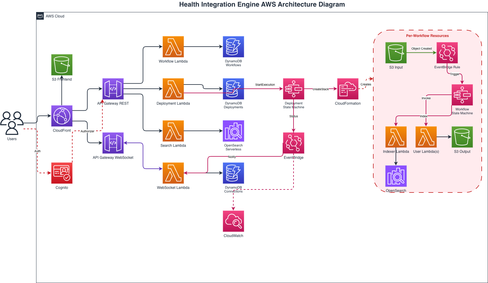

# Health Integration Engine — AWS Step Functions Workflow Builder

| Index | Description |
|:------|:------------|
| [Overview](#overview) | See the motivation behind this project |
| [Description](#description) | Learn more about the project |
| [Deployment](#deployment) | How to install and deploy the solution |
| [Usage](#usage) | How to use the workflow builder |
| [Troubleshooting](#troubleshooting) | Common issues and solutions |
| [Support](#support) | The team behind this project |
| [License](#license) | See the project's license information |
| [Disclaimers](#disclaimers) | Disclaimers information |

# Overview

Health Integration Engine is a web application that enables users to create, edit, and deploy AWS Step Functions workflows through an intuitive drag-and-drop interface. It features a CloudFormation-based deployment system with an extensible node architecture, real-time deployment and deletion progress tracking via WebSocket, and S3 event-driven workflow triggers.

This project was built to simplify the orchestration of healthcare data processing pipelines — such as HL7 message routing, file transformations, and multi-step integrations — without requiring users to write Step Functions JSON by hand or manage AWS infrastructure directly.

## Architecture Diagram



# Description

## Tech Stack

| Category | Technology | Purpose |
|:---------|:-----------|:--------|
| **Frontend** | [React](https://react.dev/) + TypeScript | Drag-and-drop workflow editor and dashboard |
| | [Vite](https://vitejs.dev/) | Development server and build tooling |
| **Backend** | [AWS Lambda](https://aws.amazon.com/lambda/) | Serverless compute for API endpoints and deployment |
| | [AWS Step Functions](https://aws.amazon.com/step-functions/) | Workflow execution engine |
| | [AWS CloudFormation](https://aws.amazon.com/cloudformation/) | Infrastructure deployment and management |
| **Infrastructure** | [AWS CDK](https://docs.aws.amazon.com/cdk/) | Infrastructure as code (TypeScript) |
| | [Amazon Cognito](https://aws.amazon.com/cognito/) | User authentication and authorization |
| | [Amazon API Gateway](https://aws.amazon.com/api-gateway/) | REST and WebSocket API management |
| | [Amazon DynamoDB](https://aws.amazon.com/dynamodb/) | NoSQL database for workflows and deployments |
| | [Amazon S3](https://aws.amazon.com/s3/) | Frontend hosting and file storage |
| | [Amazon CloudFront](https://aws.amazon.com/cloudfront/) | CDN for frontend distribution |
| | [Amazon EventBridge](https://aws.amazon.com/eventbridge/) | S3 event triggers and deployment status events |
| | [Amazon CloudWatch](https://aws.amazon.com/cloudwatch/) | Logging and monitoring |

## Project Structure

```
├── frontend/                           # React TypeScript frontend
│   ├── src/components/workflow/        # Workflow editor components
│   ├── src/services/                   # API and deployment services
│   └── src/types/                      # TypeScript type definitions
├── lambda-functions/                   # AWS Lambda functions
│   ├── workflow-lambda/                # Workflow CRUD operations
│   └── deployment-lambda/              # CloudFormation deployment system
│       ├── src/services/               # Core deployment services
│       └── src/services/nodeHandlers/  # Extensible node handlers
├── infrastructure/                     # AWS CDK infrastructure
│   ├── lib/workflow-builder-stack.ts   # Main infrastructure stack
│   └── scripts/                        # Deployment scripts
└── scripts/                            # Utility scripts
```

## Supported Node Types

| Node | Description |
|:-----|:------------|
| **Start / End** | Workflow entry and exit points |
| **Lambda** | AWS Lambda function invocation |
| **Database** | DynamoDB and RDS Data API operations |
| **S3** | S3 operations (get, put, list, delete) with event-driven triggers |
| **OpenSearch** | Index processed data into Amazon OpenSearch Serverless for search and analytics |

Adding new node types (Wait, Choice, Parallel, SNS, SQS, etc.) is straightforward with the plugin-based handler system. See the [Node Handlers Guide](lambda-functions/deployment-lambda/src/services/nodeHandlers/README.md).

## S3 Event-Triggered Workflows

Workflows can be automatically triggered when files are uploaded to an S3 bucket. The system uses EventBridge to detect `Object Created` events and start the Step Function execution.

**How it works:**
1. Add an S3 node (read operation) as the input — configure the bucket name and optional folder prefix
2. Add an S3 node (write operation) as the output — configure a **different** output bucket
3. Add Lambda nodes in between to process the file
4. Deploy the workflow — EventBridge notifications are automatically enabled on the input bucket

**Data flow:**
- The **Start** node preserves the original EventBridge event in `$.originalEvent`
- The **S3 read** node fetches the uploaded file and stores its content in `$.s3Result.Body`
- **Lambda** nodes receive the full state as `event.input` — access file content at `event['input']['s3Result']['Body']`
- The **S3 write** node writes the Lambda output (as JSON) to the output bucket with a `.json` extension

**Important notes:**
- File content from the S3 trigger is at `event['input']['s3Result']['Body']`, not `event['Body']`
- The original S3 event metadata (bucket, key, size) is at `event['input']['originalEvent']['detail']`
- The output S3 bucket **must** be different from the input trigger bucket to prevent infinite loops
- The output file name matches the input file name with a `.json` extension (e.g. `HL7Message.txt` → `HL7Message.json`)

## OpenSearch Integration

Workflows can include an OpenSearch node to automatically index processed data into Amazon OpenSearch Serverless.

- **Indexing**: Enable the OpenSearch option when creating a workflow — processed data from upstream Lambda nodes is automatically indexed into the configured collection and index
- **Search**: The dashboard includes a search panel for querying indexed data across all workflows, and the workflow details page provides workflow-specific search

# Deployment

## Prerequisites

1. An [AWS account](https://signin.aws.amazon.com/signup?request_type=register)
2. **Node.js >= 18.0.0** — [Download here](https://nodejs.org/)
3. **npm >= 8.0.0**
4. **AWS CDK** (v2) — Install via npm:
   ```bash
   npm install -g aws-cdk
   ```
5. **AWS CLI** — [Installation Guide](https://docs.aws.amazon.com/cli/latest/userguide/getting-started-install.html)
6. **Git** — [Download here](https://git-scm.com/)

## AWS Configuration

1. **Configure AWS CLI with your credentials**:
   ```bash
   aws configure
   ```

2. **Bootstrap your AWS environment for CDK** _(required only once per account/region)_:
   ```bash
   cd infrastructure
   npx cdk bootstrap
   ```

## Infrastructure Deployment

1. **Clone the repository**:
   ```bash
   git clone https://github.com/cal-poly-dxhub/health-integration-engine.git
   cd health-integration-engine
   ```

2. **Install all dependencies**:
   ```bash
   npm run install:all
   ```

3. **Deploy the complete stack** (infrastructure + frontend):

   **macOS / Linux:**
   ```bash
   ./scripts/deploy-full-stack.sh
   ```

   **Windows (PowerShell):**
   ```powershell
   .\scripts\deploy-full-stack.ps1
   ```

   This script:
   - Installs all dependencies
   - Builds Lambda functions
   - Deploys CDK infrastructure
   - Extracts outputs (API URL, Cognito IDs, etc.)
   - Updates frontend `.env` with the outputs
   - Builds and deploys frontend to S3
   - Invalidates CloudFront cache

# Usage

1. **Create a Workflow**: Click "Create New Workflow" from the dashboard
2. **Add Nodes**: Drag and drop nodes (Lambda, S3, Database) onto the canvas
3. **Connect Nodes**: Draw connections between nodes to define the execution flow
4. **Configure Nodes**: Click a node to configure its properties (function ARN, bucket name, etc.)
5. **Deploy**: Click "Deploy" to generate a CloudFormation template and deploy to AWS — real-time progress is shown in a step-by-step modal
6. **Monitor**: View execution history and details from the workflow details page
7. **Delete**: Delete a workflow from the dashboard or details page — deletion progress is shown in the same step-by-step modal as deployment

## Adding New Node Types

1. Create a handler in [`lambda-functions/deployment-lambda/src/services/nodeHandlers/`](lambda-functions/deployment-lambda/src/services/nodeHandlers/)
2. Register the handler in the [index file](lambda-functions/deployment-lambda/src/services/nodeHandlers/index.ts)
3. Add the node type to [workflow type definitions](frontend/src/types/workflow.ts)
4. Add frontend UI components for the new node type in [`frontend/src/components/workflow/`](frontend/src/components/workflow/)

See the [Node Handlers Guide](lambda-functions/deployment-lambda/src/services/nodeHandlers/README.md) for detailed instructions.

### CloudWatch Logs

- `/aws/lambda/workflow-builder-deployment` — Deployment Lambda logs
- `/aws/lambda/workflow-builder-deployment-status` — Status Lambda logs
- `/aws/stepfunctions/workflow-*` — Step Functions execution logs

# Support

For any queries or issues, please contact:
- Venkata Kampana, Sr. Solutions Architect - kampanv@amazon.com
- Darren Kraker, Sr. Solutions Architect - dkraker@amazon.com
- Shrey Shah, Student Developer - sshah84@calpoly.edu
- Zachary Hoffman, Student Developer - zihoffma@calpoly.edu

# License

This project is licensed under the [MIT License](./LICENSE).

```plaintext
MIT License

Copyright (c) 2026 Cal Poly DXHub

Permission is hereby granted, free of charge, to any person obtaining a copy
of this software and associated documentation files (the "Software"), to deal
in the Software without restriction, including without limitation the rights
to use, copy, modify, merge, publish, distribute, sublicense, and/or sell
copies of the Software, and to permit persons to whom the Software is
furnished to do so, subject to the following conditions:

The above copyright notice and this permission notice shall be included in all
copies or substantial portions of the Software.

THE SOFTWARE IS PROVIDED "AS IS", WITHOUT WARRANTY OF ANY KIND, EXPRESS OR
IMPLIED, INCLUDING BUT NOT LIMITED TO THE WARRANTIES OF MERCHANTABILITY,
FITNESS FOR A PARTICULAR PURPOSE AND NONINFRINGEMENT. IN NO EVENT SHALL THE
AUTHORS OR COPYRIGHT HOLDERS BE LIABLE FOR ANY CLAIM, DAMAGES OR OTHER
LIABILITY, WHETHER IN AN ACTION OF CONTRACT, TORT OR OTHERWISE, ARISING FROM,
OUT OF OR IN CONNECTION WITH THE SOFTWARE OR THE USE OR OTHER DEALINGS IN THE
SOFTWARE.
```

---

# Collaboration

Thanks for your interest in our solution. Having specific examples of replication and usage allows us to continue to grow and scale our work. If you clone or use this repository, kindly shoot us a quick email to let us know you are interested in this work!

# Disclaimers

**Customers are responsible for making their own independent assessment of the information in this document.**

**This document:**
(a) is for informational purposes only, (b) references AWS product offerings and practices, which are subject to change without notice, (c) does not create any commitments or assurances from AWS and its affiliates, suppliers or licensors. AWS products or services are provided "as is" without warranties, representations, or conditions of any kind, whether express or implied. The responsibilities and liabilities of AWS to its customers are controlled by AWS agreements, and this document is not part of, nor does it modify, any agreement between AWS and its customers, and (d) is not to be considered a recommendation or viewpoint of AWS.

Additionally, you are solely responsible for testing, security and optimizing all code and assets on GitHub repo, and all such code and assets should be considered: (a) as-is and without warranties or representations of any kind, (b) not suitable for production environments, or on production or other critical data, and (c) to include shortcuts in order to support rapid prototyping such as, but not limited to, relaxed authentication and authorization and a lack of strict adherence to security best practices.

All work produced is open source. More information can be found in the GitHub repo.
